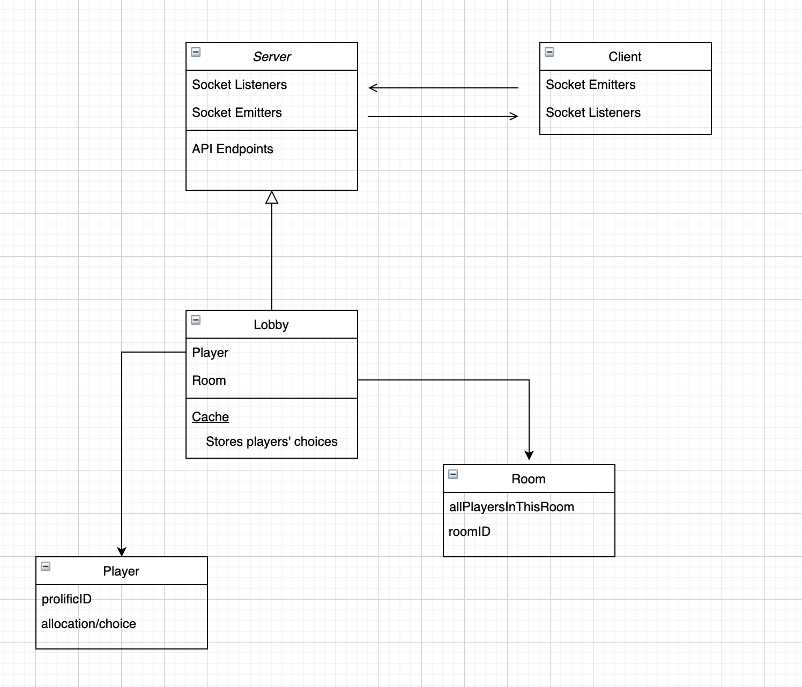

### In-code Comments

All the important methods, classes and modules in this repo include comments 
that provide high level overview of their main functionalities as well as names of the authors.

### Database Schema

We use MongoDB as our database and Mongoose as an intermediate layer to interact with the MongoDB database. 
We use four schemas/models to represent the experiment data. All of them are defined separately in 4 different files
`experiment.js`, `player.js`, `choice.js` and `allocation.js` in the folder `backend/db/models`. Each file
contains description of what each field represents and information on what data types they are defined as in Mongoose. 
You can refer to those files whenever in doubt.

### Overall Architecture Design
This section is intended to give you a high level overview of the functionality of each
component in this web application and how components interact with each other.
Below is a simplified diagram to illustrate different components in the application and 
their corresponding functionality.

There are two primary ways for the client and server to communicate. One is through sockets.
The reason for using socket can be found in our project wiki. They are mainly used for implementing gameplay logic (
e.g. receiving and responding to players' choices). Both the client and server contain socket listeners which will listen for messages 
sent by the socket emitters on the other side along with a few data parameters. 
The other way for client and server to communicate is through API routes. All the API routes provided by
the server can be found in `backend/app.js` with comments that describe what each API route does. API routes are used to complete 
more heavy-weight networking task such as retrieving large amount of data saved in the MongoDB database. Both the sockets and API routes 
are flexible enough to be modified to support new features. It's important to note that all the gameplay calculation/logic is done 
on the server and then sent back to the frontend. The reason for doing this can also be found in our design justification doc in the project wiki. 
